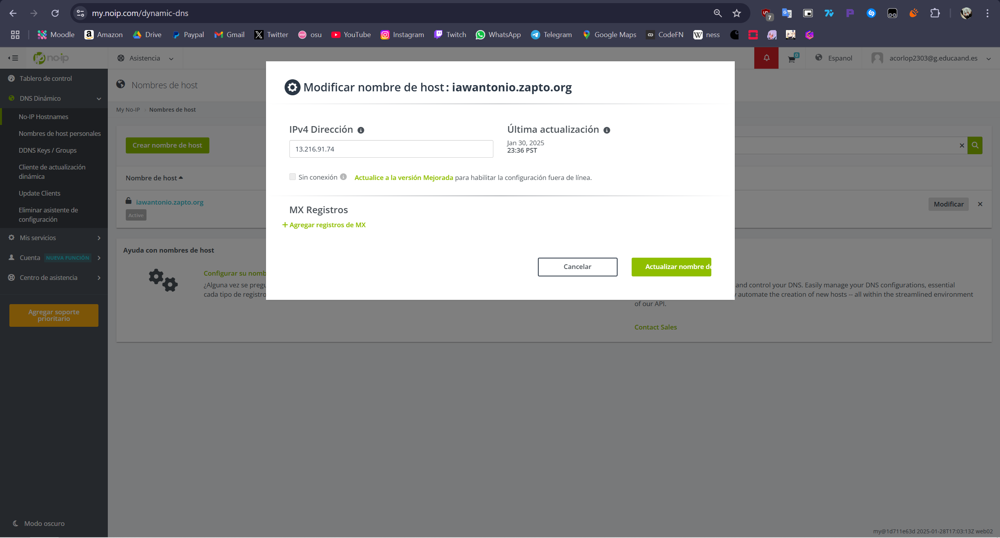

# Despliegue de Moodle en AWS con Ansible

## Índice
1. [Estructura del Proyecto](#estructura-del-proyecto)
2. [Configuración de Ansible](#configuración-de-ansible)
3. [Arquitectura Backend](#arquitectura-backend)
4. [Arquitectura Frontend](#arquitectura-frontend)
5. [Referencias](#referencias)

## Estructura del Proyecto

Estructura del repo:

```
.
├── README.md
├── templates
│   └── 000-default.conf
├── inventory
│   └── inventory
├── playbooks
│   ├── setup_letsencrypt.yml
│   ├── deploy.yml
│   ├── install_lamp_backend.yml
│   └── install_lamp_frontend.yml
├── vars
│   └── variables.yml
└── main.yml
```
## Dominio NO-IP
Debemos de tener creado un dominio en NO-IP que apunte a la ip de nuestro frontend


## Configuración de Ansible

Para comenzar con Ansible ejecutamos los siguientes comandos:

```bash
sudo apt update
sudo apt install ansible -y
```

Luego, creamos un archivo de `inventory` para definir los servidores:
- **Frontend**
- **Backend**

Además, gestionaremos el código en un repositorio de GitHub.

## Arquitectura Backend

En la carpeta `playbooks` creamos el archivo `install_lamp_backend.yml`, que será nuestro playbook para configurar la base de datos MySQL.

### Estructura básica del playbook:

```yaml
---
- name: Configurar la pila LAMP en el Backend
  hosts: backend
  become: yes

  vars_files:
    - ../vars/variables.yml
```

- `name`: Descripción de la tarea.
- `hosts`: Indica los servidores en los que se ejecutará.
- `become`: Se ejecuta con privilegios de superusuario.
- `vars_files`: Archivo que contiene las variables necesarias.

### Tareas del playbook

```yaml
  tasks:
    - name: Actualizar paquetes
      apt:
        update_cache: yes

    - name: Instalar MySQL
      apt:
        name: mysql-server
        state: present

    - name: Eliminar base de datos antigua
      mysql_db:
        name: "{{ db.name }}"
        state: absent
        login_unix_socket: /var/run/mysqld/mysqld.sock

    - name: Crear usuario de MySQL
      mysql_user:
        name: "{{ db.user }}"
        password: "{{ db.password }}"
        priv: "{{ db.name }}.*:ALL"
        host: "{{ db.frontend_private_ip }}"
        state: present
        login_unix_socket: /var/run/mysqld/mysqld.sock

    - name: Permitir acceso externo a MySQL
      replace:
        path: /etc/mysql/mysql.conf.d/mysqld.cnf
        regexp: '^bind-address.*'
        replace: 'bind-address = 0.0.0.0'

    - name: Reiniciar MySQL
      service:
        name: mysql
        state: restarted
```

## Arquitectura Frontend

El archivo `install_lamp_frontend.yml` define la instalación de Apache y PHP.

```yaml
---
- name: Configurar la pila LAMP en el Frontend
  hosts: frontend
  become: yes

  tasks:
```

### Instalación de PHP y módulos necesarios

```yaml
    - name: Instalar PHP y módulos
      apt:
        name:
          - php
          - libapache2-mod-php
          - php-mysql
          - php-xml
          - php-mbstring
          - php-curl
          - php-zip
          - php-gd
          - php-intl
          - php-soap
          - php-ldap
          - php-opcache
          - php-cli
        state: present
```

### Configuración de parámetros de PHP

```yaml
    - name: Ajustar max_input_vars
      replace:
        path: /etc/php/8.3/apache2/php.ini
        regexp: max_input_vars = 1000
        replace: max_input_vars = 5000
```

```yaml
    - name: Ajustar max_execution_time
      replace:
        path: /etc/php/8.3/apache2/php.ini
        regexp: '^;max_execution_time\s=.*'
        replace: 'max_execution_time = 300'
```

### Configuración de Apache

```yaml
    - name: Copiar configuración de Apache
      copy:
        src: ../templates/000-default.conf
        dest: /etc/apache2/sites-available/
        mode: 0755

    - name: Habilitar el módulo rewrite
      apache2_module:
        name: rewrite
        state: present

    - name: Reiniciar Apache
      service:
        name: apache2
        state: restarted
```

## Despliegue de Moodle

El `deploy.yml` contiene las tareas necesarias para desplegar Moodle en el servidor.

```yaml
    - name: Descargar Moodle
      get_url:
        url: https://github.com/moodle/moodle/archive/refs/tags/v4.3.1.zip
        dest: /tmp
        mode: 0755

    - name: Extraer Moodle
      unarchive:
        src: /tmp/moodle-4.3.1.zip
        dest: /tmp
        remote_src: yes
```

```yaml
    - name: Instalar Moodle vía CLI
      command:
        sudo -u www-data php /var/www/html/admin/cli/install.php \
        --wwwroot={{ moodle.www_root }} \
        --dataroot={{ moodle.data_root }} \
        --dbtype={{ moodle.type }} \
        --dbhost={{ moodle.host }} \
        --dbname={{ db.name }} \
        --dbuser={{ db.user }} \
        --dbpass={{ db.password }} \
        --fullname="{{ moodle.fullname }}" \
        --shortname="{{ moodle.shortname }}" \
        --summary="{{ moodle.summary }}" \
        --adminuser={{ moodle.admin_user }} \
        --adminpass={{ moodle.admin_pass }} \
        --adminemail={{ moodle.admin_email }} \
        --non-interactive \
        --agree-license
```

## Configuración de Let’s Encrypt

El `setup_letsencrypt_https.yml` configura el certificado SSL:

```yaml
    - name: Instalar Certbot
      apt:
        name: certbot
        state: present
```

```yaml
    - name: Generar certificado SSL
      command:
        certbot --apache --non-interactive --agree-tos --email {{ ssl.email }} --domains {{ ssl.domain }}
```

## Archivo `inventory`

```ini
[frontend]
<ip_publica>

[backend]
<ip_publica>

[all:vars]
ansible_user=ubuntu
ansible_ssh_private_key_file=/home/ubuntu/Moodleansible/moodle/clave.pem
ansible_ssh_common_args='-o StrictHostKeyChecking=accept-new'
```

## Referencias
- [Instalación de Ansible](https://josejuansanchez.org/taller-ansible-aws/#_ejemplo_12)
- [Módulos de Ansible](https://docs.ansible.com/ansible/latest/module_plugin_guide/index.html)
- [Primeros pasos con Ansible](https://blog.deiser.com/es/primeros-pasos-con-ansible)
