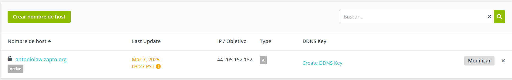
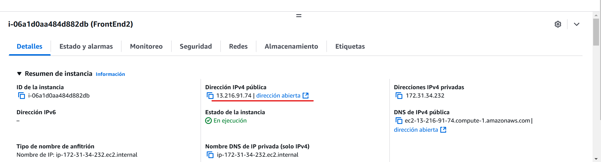
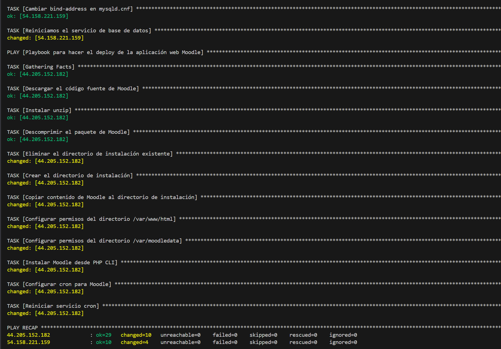
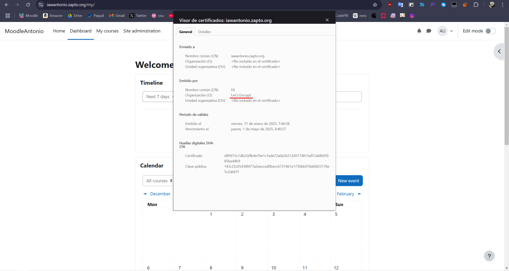

# Despliegue de Moodle en AWS con Ansible

## Índice
1. [Estructura del Proyecto](#estructura-del-proyecto)
2. [Configuración de Ansible](#configuración-de-ansible)
3. [Arquitectura Backend](#arquitectura-backend)
4. [Arquitectura Frontend](#arquitectura-frontend)
5. [Referencias](#referencias)

## Estructura del Proyecto

Estructura del repo:

```
.
├── README.md
├── templates
│   └── 000-default.conf
├── inventory
│   └── inventory
├── playbooks
│   ├── setup_letsencrypt.yml
│   ├── deploy.yml
│   ├── install_lamp_backend.yml
│   └── install_lamp_frontend.yml
├── vars
│   └── variables.yml
└── main.yml
```
## Dominio NO-IP
Debemos de tener creado un dominio en NO-IP que apunte a la ip de nuestro frontend


(Muestro la ip del frontend para que veas que es la misma que he puesto en el NO-IP y que no me lo estoy inventando)


## Configuración de Ansible

Para comenzar con utilizar ansible debemos instalarlo con los siguientes comandos:

```bash
sudo apt update
sudo apt install ansible -y
```

Luego, creamos un archivo de `inventory` en la carpeta inventory para definir el frontend y el backend:
- **Frontend**
- **Backend**

## Arquitectura Backend

En la carpeta `playbooks` creamos el archivo `install_lamp_backend.yml`, que será nuestro playbook para configurar la base de datos MySQL.

### Estructura del playbook del Backend:

```yaml
---
- name: Playbook para instalar la pila LAMP en el Backend
  hosts: backend
  become: yes

  vars_files:
    - ../vars/variables.yml

  tasks:

    - name: Actualizar los repositorios
      apt:
        update_cache: yes

    - name: Instalar el sistema gestor de bases de datos MySQL
      apt:
        name: mysql-server
        state: present

    - name: Instalamos el módulo de pymysql
      apt:
        name: python3-pymysql
        state: present

    - name: Eliminar la base de datos
      mysql_db:
        name: "{{ db.name }}"
        state: absent
        login_unix_socket: /var/run/mysqld/mysqld.sock

    - name: Crear una base de datos
      mysql_db:
        name: "{{ db.name }}"
        state: present
        login_unix_socket: /var/run/mysqld/mysqld.sock 

    - name: Crear el usuario de la base de datos
      mysql_user:         
        name: "{{ db.user }}"
        password: "{{ db.password }}"
        priv: "{{ db.name }}.*:ALL"
        host: "{{ db.frontend_private_ip }}"
        state: present
        login_unix_socket: /var/run/mysqld/mysqld.sock 

    - name: Configuramos MySQL para permitir conexiones desde cualquier interfaz
      replace:
        path: /etc/mysql/mysql.conf.d/mysqld.cnf
        regexp: 127.0.0.1
        replace: 0.0.0.0

    - name: Cambiar bind-address en mysqld.cnf
      replace:
        path: /etc/mysql/mysql.conf.d/mysqld.cnf
        regexp: '^bind-address.*'
        replace: 'bind-address = 0.0.0.0'

    - name: Reiniciamos el servicio de base de datos
      service:
        name: mysql
        state: restarted
# No es un playbook complejo, simplemente instalamos MYSQL y sus módulos, después creamos la base de datos y el usuario y después cambiamos los bind-addresses para permitir conexiones de todas las ips (aunque no sea lo más seguro es lo más práctico para esta tarea teniendo en cuenta que tuve que eliminar las máquinas varias veces)
```

## Arquitectura Frontend

El archivo `install_lamp_frontend.yml` define la instalación de Apache y PHP.

```yaml
---
- name: Playbook para instalar la pila LAMP en el FrontEnd
  hosts: frontend
  become: yes

  tasks:

    - name: Actualizar los repositorios
      apt:
        update_cache: yes

    - name: Instalar el servidor web Apache
      apt:
        name: apache2
        state: present

    - name: Instalar PHP y los módulos necesarios
      apt: 
        name: 
          - php
          - libapache2-mod-php
          - php-mysql
          - php-xml
          - php-mbstring
          - php-curl
          - php-zip
          - php-gd
          - php-intl
          - php-soap
          - php-ldap
          - php-opcache
          - php-cli
        state: present

    - name: Habilitar el módulo rewrite de Apache
      apache2_module:
        name: rewrite
        state: present

    - name: Modificamos el valor max_input_vars de PHP
      replace: 
        path: /etc/php/8.3/apache2/php.ini
        regexp: '^;max_input_vars\s=.*'
        replace: max_input_vars = 5000

    - name: Modificamos el valor max_input_vars de PHP
      replace: 
        path: /etc/php/8.3/cli/php.ini
        regexp: '^;max_input_vars\s=.*'
        replace: max_input_vars = 5000


    - name: Modificamos el valor de memory_limit de PHP
      replace: 
        path: /etc/php/8.3/apache2/php.ini
        regexp: '^;memory_limit\s=.*'
        replace: memory_limit = 256M

    - name: Modificamos el valor memory_limit de PHP CLI
      replace:
        path: /etc/php/8.3/cli/php.ini
        regexp: '^;memory_limits\s=.*'
        replace: memory_limit = 256M


    - name: Modificamos el valor de post_max_size de PHP
      replace: 
        path: /etc/php/8.3/apache2/php.ini
        regexp: '^;post_max_size\s=.*'
        replace: post_max_size = 128M

    - name: Modificamos el valor de post_max_size de PHP
      replace: 
        path: /etc/php/8.3/cli/php.ini
        regexp: '^;post_max_size\s=.*'
        replace: post_max_size = 128M


    - name: Modificamos el valor de upload_max_filesize de PHP
      replace:
        path: /etc/php/8.3/apache2/php.ini
        regexp: '^;upload_max_filesize\s=.*'
        replace: upload_max_filesize = 128M

    - name: Modificamos el valor de upload_max_filesize de PHP
      replace:
        path: /etc/php/8.3/cli/php.ini
        regexp: '^;upload_max_filesize\s=.*'
        replace: upload_max_filesize = 128M

    - name: Modificamos el valor max_execution_time de PHP
      replace:
        path: /etc/php/8.3/apache2/php.ini
        regexp: '^;max_execution_time\s=.*'
        replace: 'max_execution_time = 300'
        
    - name: Modificamos el valor max_execution_time de PHP CLI
      replace:
        path: /etc/php/8.3/cli/php.ini
        regexp: '^;max_execution_time\s=.*'
        replace: 'max_execution_time = 300'

    - name: Copiar el archivo de configuración de Apache
      copy:
        src: ../templates/000-default.conf
        dest: /etc/apache2/sites-available/
        mode: 0755


    - name: Reiniciar el servidor web Apache
      service:
        name: apache2
        state: restarted
# En este playbook instalamos apache y sus modulos necesario, lo habilitamos y modificamos los valores, despues lo movemos a sites-available y reiniciamos apache.
```

## Configuración de Let’s Encrypt

El `setup_letsencrypt.yml` configura el certificado SSL de:

```yaml
---
- name: Playbook para configurar HTTPS
  hosts: frontend
  become: yes

  vars_files:
    - ../vars/variables.yml

  tasks:

    - name: Desinstalar instalaciones previas de Certbot
      apt:
        name: certbot
        state: absent

    - name: Instalar Certbot con snap
      snap:
        name: certbot
        classic: yes
        state: present

    - name: Solicitar y configurar certificado SSL/TLS a Let's Encrypt con certbot
      command:
        certbot --apache \
        -m {{ certbot.le_email }} \
        --agree-tos \
        --no-eff-email \
        --non-interactive \
        -d {{ certbot.le_domain }}
# Esto es sencillo, pedimos el certificado a let's encrypt y debemos tener nuestro dominio definido en la variable "le_domain" en el archivo de "variables.yml"
```
## Despliegue de Moodle

El `deploy.yml` contiene las tareas necesarias para desplegar Moodle en el servidor.

```yaml
---
- name: Playbook para hacer el deploy de la aplicación web moodle
  hosts: frontend
  become: yes

  vars_files:
    - ../vars/variables.yml

  tasks:

    - name: Descargar el código fuente de moodle
      get_url:
        url: https://github.com/moodle/moodle/archive/refs/tags/v4.3.1.zip 
        dest: /tmp
        mode: 0755

    - name: Instalar unzip
      apt: 
        name: unzip
        state: present

    - name: Descomprimir el paquete de moodle
      unarchive:
        src: /tmp/moodle-4.3.1.zip  
        dest: /tmp
        remote_src: yes

    - name: Eliminar el directorio de instalación
      file:
        path: /var/www/html/
        state: absent

    - name: Crear el directorio de instalación
      file:
        path: /var/www/html
        state: directory
        owner: www-data
        group: www-data
        mode: 0755

    - name: Copiar contenido de moodle-4.3.1 a /var/www/html
      copy:
        src: /tmp/moodle-4.3.1/
        dest: /var/www/html
        remote_src: true
        force: yes

    - name: Modificar los permisos del directorio /var/www/html
      file:
        path: /var/www/html
        owner: www-data
        group: www-data
        recurse: yes
        mode: 0755

    - name: Modificar los permisos del directorio /var/moodledata
      file:
        path: /var/moodledata
        owner: www-data
        group: www-data
        recurse: yes
        mode: 0755
        
    - name: Instalar moodle desde PHP CLI
      command:
        sudo -u www-data php /var/www/html/admin/cli/install.php \
        --wwwroot={{ moodle.www_root }} \
        --dataroot={{ moodle.data_root }} \
        --dbtype={{ moodle.type }} \
        --dbhost={{ moodle.host }} \
        --dbname={{ db.name }} \
        --dbuser={{ db.user }} \
        --dbpass={{ db.password }} \
        --fullname="{{ moodle.fullname }}" \
        --shortname="{{ moodle.shortname }}" \
        --summary="{{ moodle.summary }}" \
        --adminuser={{ moodle.admin_user }} \
        --adminpass={{ moodle.admin_pass }} \
        --adminemail={{ moodle.admin_email }} \
        --non-interactive \
        --agree-license
      args:
        chdir: /var/www/html

    - name: Configurar cron para Moodle
      become: yes
      ansible.builtin.cron:
        name: "Moodle Cron Job"
        minute: "*"
        job: "/usr/bin/php /var/www/html/admin/cli/cron.php >/dev/null 2>&1"
        state: present


    - name: Reiniciar servicio cron 
      become: yes
      ansible.builtin.service:
        name: cron
        state: restarted
        enabled: yes
# Aqui se hace lo tipico que ya hemos hecho antes en otras practicas, descargamos moodle en la carpeta temporal, lo descomprimimos, lo movemos, asignamos permisos a los directorios que estamos usando para moodle y usamos las variables definidas en variables.yml, puse cron por si acaso, para asegurar de que esté habilitado en el arranque del sistema.
```

## Archivo `inventory`

```bash
[frontend]
<Aquí va la ip pública del frontend>

[backend]
<Aquí va la ip pública del backend>

[all:vars]
ansible_user=ubuntu
ansible_ssh_private_key_file=/home/ubuntu/Practica-3.1/moodle/vockey.pem
ansible_ssh_common_args='-o StrictHostKeyChecking=accept-new'     

# Archivo muy importante donde estableceremos las ips del frontend y backend, usuario de la máquina y vockey que cogerán nuestro frontend y backend, y que acepte automaticamente la nueva clave
```

## Comprobación del Funcionamiento 
Aqui muestro la salida del comando

En esta captura muestro el la pantalla de Moodle y además el certificado otorgado por Let's Encrypt



## Referencias
- [Instalación de Ansible](https://josejuansanchez.org/taller-ansible-aws/#_ejemplo_12)
- [Módulos de Ansible](https://docs.ansible.com/ansible/latest/module_plugin_guide/index.html)
- [Primeros pasos con Ansible](https://blog.deiser.com/es/primeros-pasos-con-ansible)
